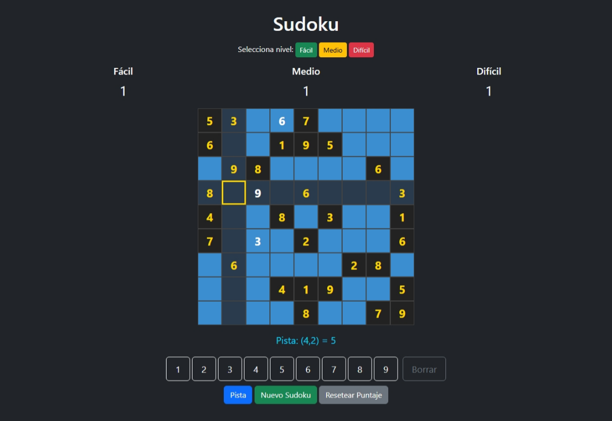

# Sudoku Node.js + Bootstrap 5



## Descripción

Sudoku interactivo con tres niveles de dificultad, pistas, validación de jugadas, sombreado de fila/columna, y guardado de puntaje persistente.  
Frontend moderno con Bootstrap 5 y backend Node.js (Express).

## Comunicación

- **Frontend**: Bootstrap 5, HTML, JS.  
  - Lógica de tablero, validación, pistas y UI en `public/js/`.
  - Comunicación con backend vía fetch/AJAX.
- **Backend**: Node.js (Express).
  - Endpoints REST para guardar/cargar puntaje.
  - Puntaje persistente en `data/score.json`.

## Instalación

```bash
npm install
```

```bash
npm start
```

```bash
Abre http://localhost:3000
```

## Diccionario Español-Inglés de variables
nivel: level
facil: easy
medio: medium
dificil: hard
celda: cell
fila: row
columna: col
tablero: board
pista: hint
puntaje: score
borrar: delete
estado: status
seleccionada: selected
numero: number
juego: game