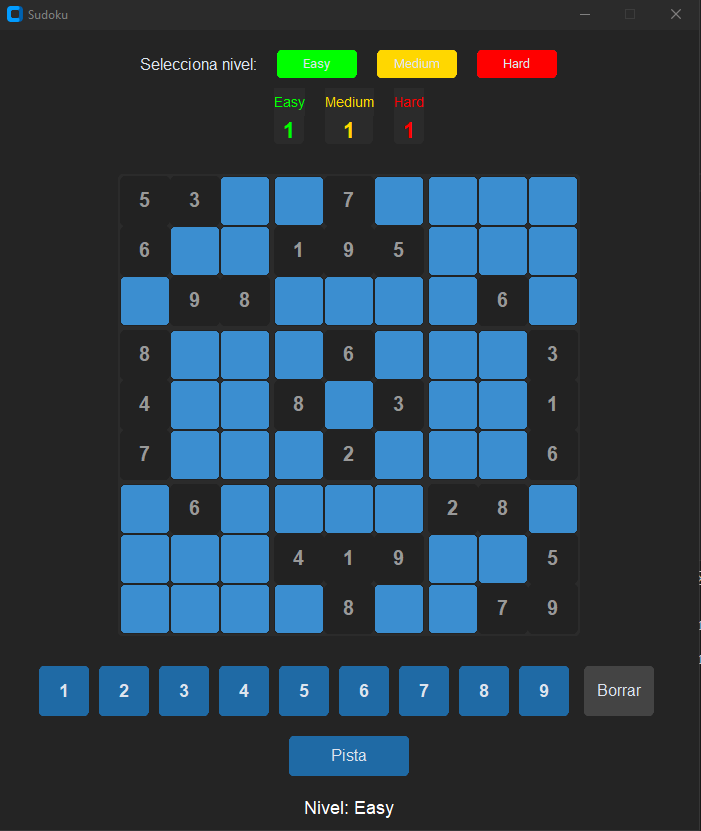

# Sudoku Python - CustomTkinter



## Descripcion

Este proyecto es un Sudoku interactivo en Python, con interfaz moderna usando CustomTkinter, niveles de dificultad, pistas, validación de jugadas, y guardado de puntaje por nivel.

---

## Comunicación entre módulos

- **main.py**: Punto de entrada. Llama a la interfaz gráfica.
- **gui/app.py**: Controla la interfaz, el tablero, la entrada de usuario, y conecta con la lógica y el puntaje.
- **logic/game.py**: Lógica del Sudoku (validación, comprobación de completitud, pistas).
- **data/score_manager.py**: Guarda y carga el puntaje en un archivo JSON.
- **data/puzzles.py**: Contiene los tableros iniciales y soluciones para cada nivel.

---

## Funcionamiento

- Al iniciar, puedes elegir el nivel (fácil, medio, difícil).
- El tablero se muestra con celdas iniciales bloqueadas.
- Haz clic en una celda y usa el teclado o los botones para ingresar un número.
- Puedes mover la celda seleccionada con las flechas o WASD.
- Si pones un número incorrecto, la celda se pone anaranjada.
- El botón "Pista" rellena una celda vacía aleatoria.
- Al completar el Sudoku correctamente, se muestra el mensaje "¡Ganaste ù.ú!" y se suma el puntaje.
- El puntaje se guarda automáticamente por nivel en `sudoku_score.json`.

---

## Diccionario Español-Inglés de variables

- nivel: level
- facil: easy
- medio: medium
- dificil: hard
- celda: cell
- fila: row
- columna: col / column
- tablero: board
- pista: hint
- puntaje: score
- marcador: score board
- borrar: delete
- estado: status
- seleccionada: selected
- numero: number
- juego: game
- guardar: save
- cargar: load
- archivo: file
- ruta: path
- inicial: initial
- solucion: solution
- vacía: empty
- completo: completed

---

## Requisitos

- Python 3.8+
- [CustomTkinter](https://github.com/TomSchimansky/CustomTkinter)

Instala CustomTkinter con:
```bash
pip install customtkinter
```
